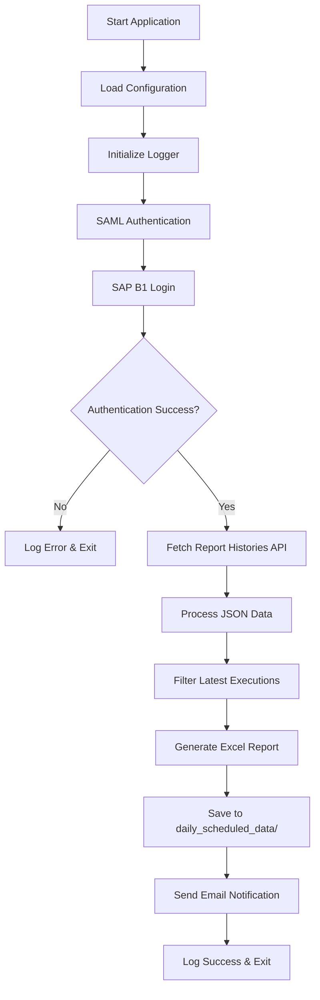
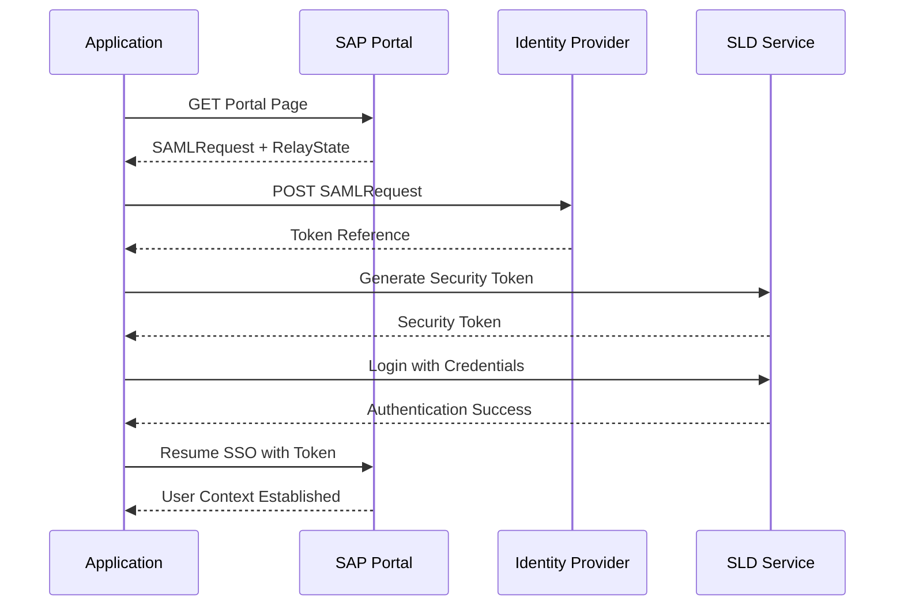
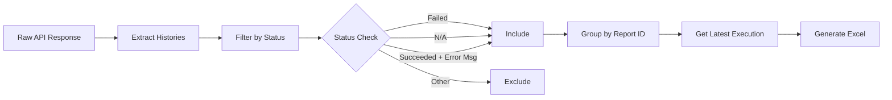

# Analytical Portal Scraping System

A Python-based automated system for extracting failed report execution data from SAP Business One Analytics Portal and sending email notifications.

## 🎯 Purpose

This system monitors SAP B1 Analytics Portal for failed report executions, filters the data to show only the latest execution per report ID, and automatically generates Excel reports with email notifications.

## 📁 Project Structure

```
analytical-portal-scraping/
├── src/
│   ├── auth.py           # SAML + SAP B1 authentication flow
│   ├── config.py         # Configuration management
│   ├── email_sender.py   # SMTP email functionality
│   ├── processor.py      # Data processing and Excel generation
│   └── utils.py          # Logging utilities
├── daily_scheduled_data/ # Generated Excel reports (auto-created)
├── logs/                 # Application logs (auto-created)
├── .env.example          # Environment variables template
├── main.py               # Main application entry point
└── README.md
```

## 🔄 System Flow



## 🔐 Authentication Flow



## ⚙️ Configuration

### Environment Variables

Copy `.env.example` to `.env` and configure:

```bash
# Base Configuration
BASE_URL=https://your-sap-server:40000

# SAP B1 Credentials
DB_INSTANCE=NDB@your-server:30013
COMPANY_DB=YOUR_COMPANY_DB
SAP_USERNAME=your_username
SAP_PASSWORD=your_password

# Email Configuration
SMTP_SERVER=smtp.gmail.com
SMTP_PORT=587
SENDER_EMAIL=your-email@company.com
SENDER_PASSWORD=your-app-password

# Recipients (comma separated)
EMAIL_TO=recipient1@company.com,recipient2@company.com
EMAIL_CC=manager@company.com
```

### File Paths (Configurable in `src/config.py`)

- **Output Directory**: `daily_scheduled_data/` - Generated Excel reports
- **Log Directory**: `logs/` - Application logs
- **Log File**: `logs/logs.txt` - Continuous log file

## 📊 Data Processing Logic



### Inclusion Criteria

Reports are included if they meet ANY of these conditions:
- Status = "failed"
- Status = "n/a" 
- Status = "succeeded" AND message contains "failed to send by email"
- Status = "succeeded" AND message contains "too many login attempts"

## 🚀 Installation & Usage

### Prerequisites

- Python 3.12+
- SAP B1 Analytics Portal access
- SMTP server access (for email notifications)

### Setup

1. **Clone and install dependencies:**
   ```bash
   git clone <repository-url>
   cd analytical-portal-scraping
   uv sync
   ```

2. **Configure environment:**
   ```bash
   cp .env.example .env
   # Edit .env with your credentials
   ```

3. **Run the application:**
   ```bash
   uv run main.py
   ```

## 📧 Email Notifications

The system automatically sends emails with:
- **Subject**: "Failed Reports Alert - [filename].xlsx"
- **Recipients**: Configured in `EMAIL_TO` and `EMAIL_CC`
- **Attachment**: Generated Excel report

## 📝 Logging

- **Console Output**: Real-time logs with timestamp
- **File Logging**: Continuous logging to `logs/logs.txt`
- **Log Levels**: INFO, WARNING, ERROR, CRITICAL

## 🔧 Dependencies

- `requests` - HTTP client for API calls
- `beautifulsoup4` - HTML parsing for SAML flow
- `openpyxl` - Excel file generation
- `python-dotenv` - Environment variable management

## 📈 Output Format

Generated Excel files contain:
- **RCRI Code**: Report identifier
- **Report Name**: Report display name
- **Schedule Name**: Execution schedule name
- **Execute Time**: Timestamp of execution
- **Status**: Execution status (failed/n/a/succeeded)
- **Message**: Error/detailed message
- **Report ID**: Unique report identifier
- **Schedule ID**: Schedule identifier

Files are named: `latest_history_YYYYMMDD_HHMMSS.xlsx`

## 🛠️ Troubleshooting

### Common Issues

1. **Authentication Failed**
   - Verify SAP B1 credentials
   - Check BASE_URL accessibility
   - Ensure database instance is correct

2. **Email Not Sending**
   - Verify SMTP settings
   - Check app password for Gmail
   - Confirm recipient email addresses

3. **No Data Found**
   - Check if there are failed reports in the timeframe
   - Verify API endpoint accessibility
   - Review logs for filtering criteria

### Log Analysis

Check `logs/logs.txt` for detailed error information:
- Authentication flow steps
- API response status codes
- Data processing statistics
- Email sending results